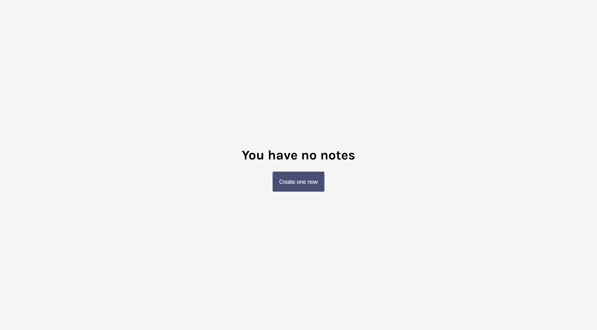
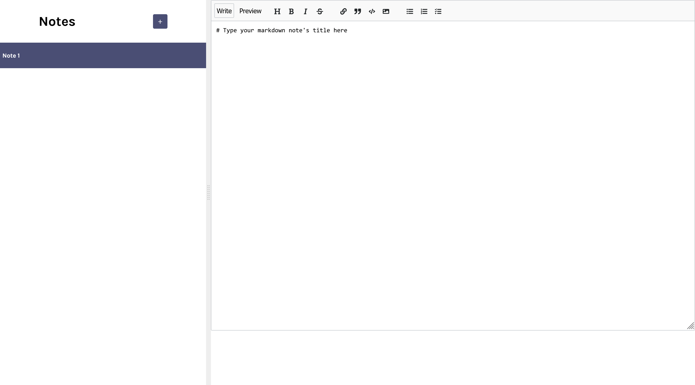
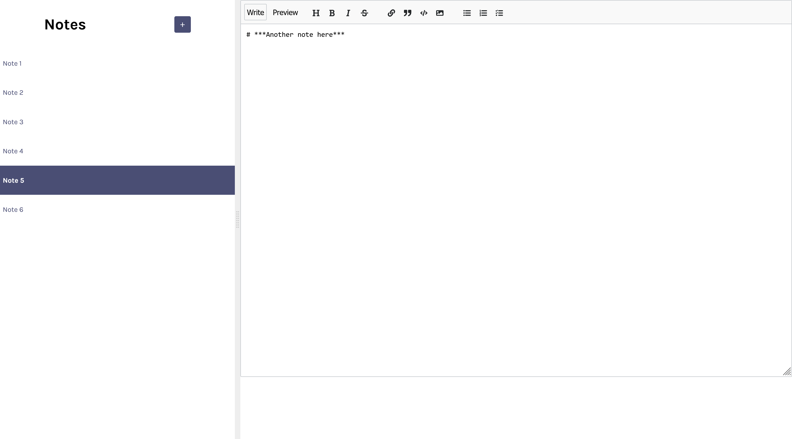

# About
Application created through ReactJS on Scrimba course.

# Features / Components
- Provides users with ability to create and save unlimited notes
- Allows notes to be edited
- ReactJS

# Screenshots (opening page / editor page)

